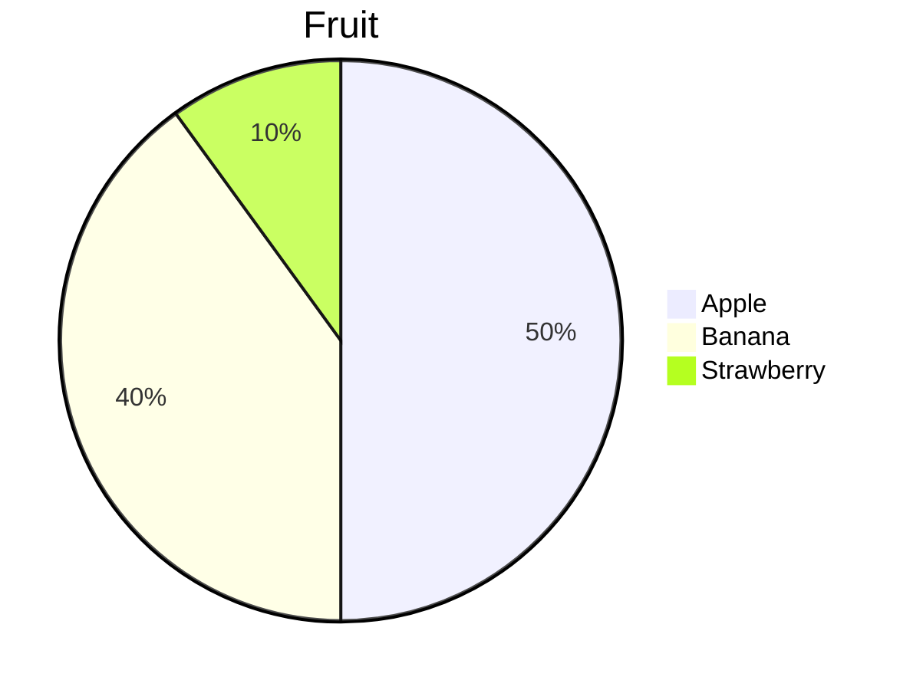
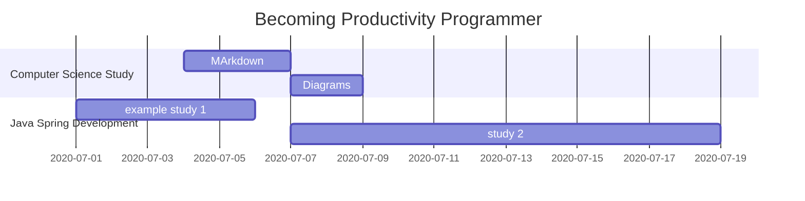
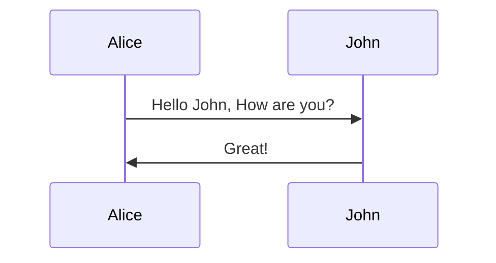
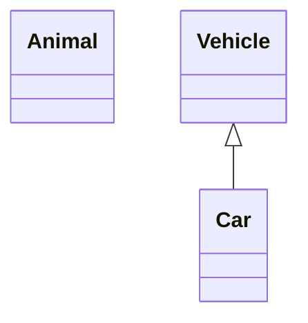
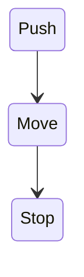
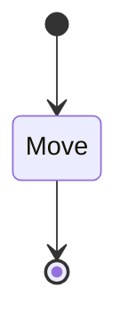
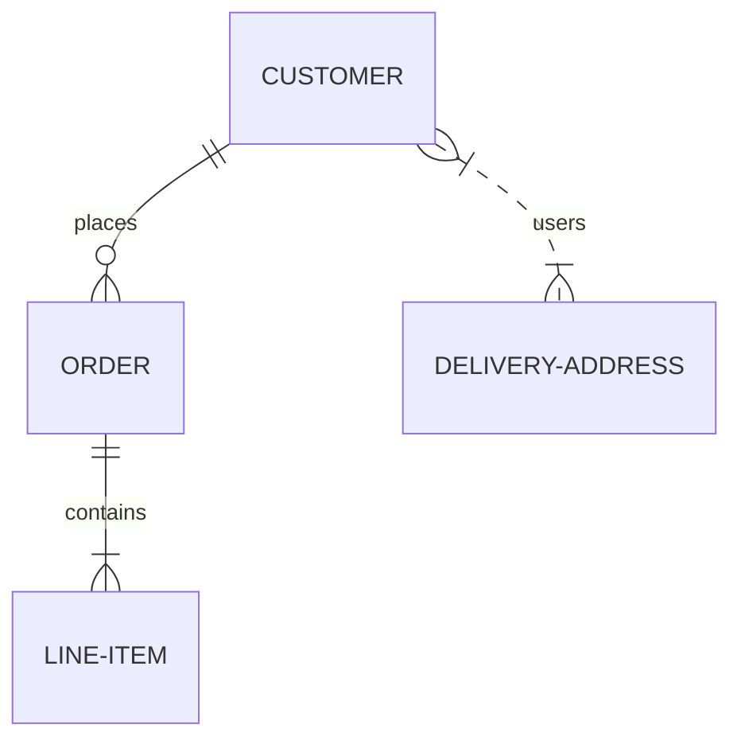
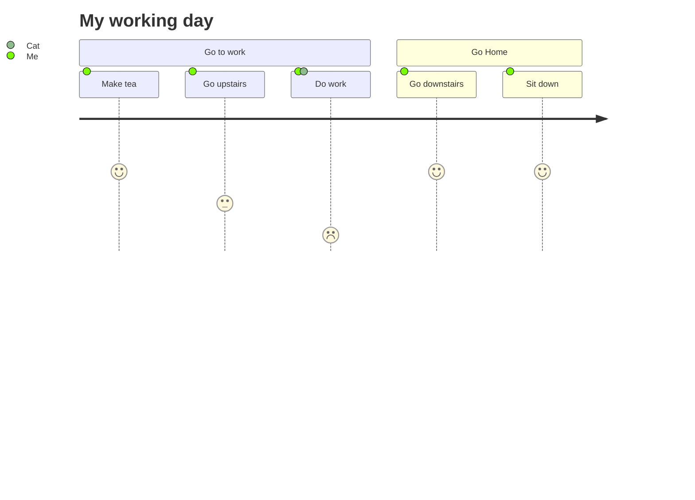

Markdown 문서 환경에서 사용가능한 공식 Diagram Library, ``mermaid`` 사용법에 대하여 많이 쓰는 요소들 위주로 정리한 문서이다.

# Graphs

## Direction
- Top to Bottom
	```mermaid
	graph TB
	a --> b
	```
    코드 : 
    ~~~md
    ```mermaid
	graph TB
	a --> b
	```
    ~~~
- Bottom to Top
	```mermaid
	graph BT
	a --> b
	```
    코드 : 
    ~~~md
    ```mermaid
	graph BT
	a --> b
	```
    ~~~
- Left to Right
	```mermaid
	graph LR
	a --> b
	```
    코드 : 
    ~~~md
    ```mermaid
	graph LR
	a --> b
	```
    ~~~
- Right to Left
	```mermaid
	graph RL
	a --> b
	```
    코드 : 
    ~~~md
    ```mermaid
	graph RL
	a --> b
	```
    ~~~

## Shapes

- Normal Box
	```mermaid
	graph TD
	boxa[Normal Box with Text]
	```
    코드 : 
    ~~~md
    ```mermaid
	graph TD
	boxa[Normal Box with Text]
	```
    ~~~
- Phill Shaped Box
	```mermaid
	graph TD
	boxa([Normal Box with Text])
	```
    코드 : 
    ~~~md
    ```mermaid
	graph TD
	boxa([Normal Box with Text])
	```
    ~~~
- Box with Rounded edges
	```mermaid
	graph TD
	boxa(Normal Box with Text)
	```
    코드 : 
    ~~~md
    ```mermaid
	graph TD
	boxa(Normal Box with Text)
	```
    ~~~
- Subroutine shaped Box
	```mermaid
	graph TD
	boxa[[Normal Box with Text]]
	```
    코드 : 
    ~~~md
    ```mermaid
	graph TD
	boxa[[Normal Box with Text]]
	```
    ~~~
- Cylindrical Shape
	```mermaid
	graph TD
	boxa[(Normal Box with Text)]
	```
    코드 : 
    ~~~md
    ```mermaid
	graph TD
	boxa[(Normal Box with Text)]
	```
    ~~~
- Circle
	```mermaid
	graph TD
	boxa((Normal Box with Text))
	```
    코드 : 
    ~~~md
    ```mermaid
	graph TD
	boxa((Normal Box with Text))
	```
    ~~~
- Asymmetric Shape
	```mermaid
	graph TD
	boxa>Normal Box with Text]
	```
    코드 : 
    ~~~md
    ```mermaid
	graph TD
	boxa>Normal Box with Text]
	```
    ~~~
- Rhombus
	```mermaid
	graph TD
	boxa{Normal Box with Text}
	```
    코드 : 
    ~~~md
    ```mermaid
	graph TD
	boxa{Normal Box with Text}
	```
    ~~~
- Hexagon
	```mermaid
	graph TD
	boxa{{Normal Box with Text}}
	```
    코드 : 
    ~~~md
    ```mermaid
	graph TD
	boxa{{Normal Box with Text}}
	```
    ~~~
- Parallelogram
	```mermaid
	graph TD
	boxa[/Normal Box with Text/]
	```
    코드 : 
    ~~~md
    ```mermaid
	graph TD
	boxa[/Normal Box with Text/]
	```
    ~~~
- Parallelogram Alternative
	```mermaid
	graph TD
	boxa[\Normal Box with Text\]
	```
    코드 : 
    ~~~md
    ```mermaid
	graph TD
	boxa[\Normal Box with Text\]
	```
    ~~~
- Trapezoid
	```mermaid
	graph TD
	boxa[/Normal Box with Text\]
	```
    코드 : 
    ~~~md
    ```mermaid
	graph TD
	boxa[/Normal Box with Text\]
	```
    ~~~
- Trapezoid Alternative
	```mermaid
	graph TD
	boxa[\Normal Box with Text/]
	```
    코드 : 
    ~~~md
    ```mermaid
	graph TD
	boxa[\Normal Box with Text/]
	```
    ~~~

## Links
- Arrow head
	```mermaid
	graph LR
	a-->b
	```
    코드 : 
    ~~~md
    ```mermaid
	graph LR
	a-->b
	```
    ~~~
- Open Link
	```mermaid
	graph LR
	a---b
	```
    코드 : 
    ~~~md
    ```mermaid
	graph LR
	a---b
	```
    ~~~
- Text on Link
	```mermaid
	graph LR
	a--text-->b
	```
    코드 : 
    ~~~md
    ```mermaid
	graph LR
	a--text-->b
	```
    ~~~
- Dotted Link
	```mermaid
	graph LR
	a-.->b
	```
    코드 : 
    ~~~md
    ```mermaid
	graph LR
	a-.->b
	```
    ~~~
- Dotted Link with Text
	```mermaid
	graph LR
	a-.Text.->b
	```
    코드 : 
    ~~~md
    ```mermaid
	graph LR
	a-.Text.->b
	```
    ~~~
- Thick Link
	```mermaid
	graph LR
	a==>b
	```
    코드 : 
    ~~~md
    ```mermaid
	graph LR
	a==>b
	```
    ~~~

# PieChart


코드 : 
~~~md

~~~

# GanttChart


코드 : 
~~~md

~~~

# Sequence Diagram


코드 : 
~~~md

~~~

# Class Diagram


코드 : 
~~~md

~~~

# State Diagram


코드 : 
~~~md

~~~


코드 : 
~~~md

~~~

# Entity Relationship Diagram


코드 : 
~~~md

~~~
# User Journey


코드 : 
~~~md

~~~